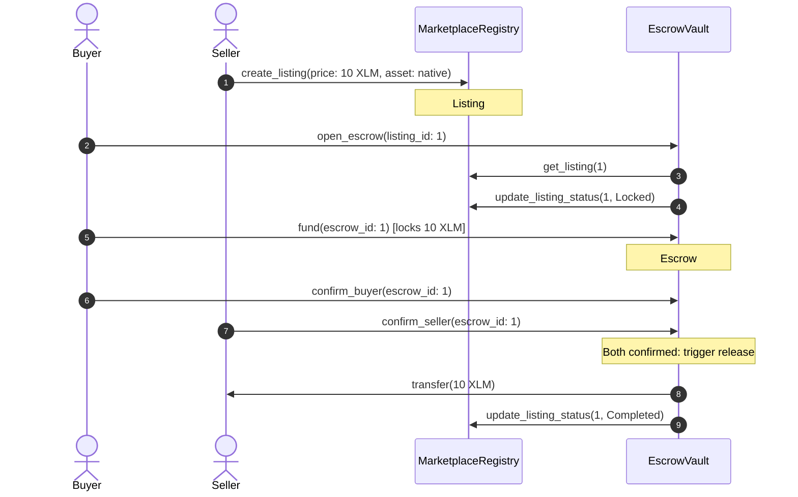

# LumenLock — Interactive Walkthrough & Demo Guide

> **Soroban Escrow Protocol Demonstration**
> 
> This document guides judges and auditors through step-by-step testing of the LumenLock smart contracts and user interface on the Stellar Testnet.

---

## 🎥 Demo Video Storyboard (Under 3 Minutes)

Below is the structured script and storyboard for a recording of the LumenLock application in action.

*(Click above to view the placeholder video link for the demo walkthrough)*

### Storyboard Breakdown (180 Seconds Total)

| Time | Scene | Audio Script / Voiceover | Focus Area |
|---|---|---|---|
| **0:00 - 0:30** | **Landing & Connect** | *"Welcome to LumenLock. We are looking at a trustless P2P marketplace built on Stellar. First, we connect our wallet using Freighter on the Testnet..."* | Hero banner, connecting Freighter via StellarWalletsKit |
| **0:30 - 1:15** | **Buyer Escrow Flow** | *"We select a digital product listed by a seller. As a buyer, we click 'Buy with Escrow' which constructs the open_escrow transaction. Once signed, we fund it by locking our XLM/USDC directly into the contract vault..."* | Marketplace page, opening escrow, funding transaction toast |
| **1:15 - 2:00** | **Seller Confirmation** | *"Switching to the seller's view on the dashboard, we see the escrow is funded. Once the digital asset is delivered, both parties independently confirm. The vault automatically releases the funds to the seller..."* | Dashboard view, confirm actions, auto-release trigger |
| **2:00 - 2:40** | **Disputes & Refunds** | *"If a dispute arises, the buyer can raise a dispute, freezing the funds. The designated arbiter can resolve it. If the seller goes silent, a full refund is claimable after the 7-day deadline..."* | Dispute freezing, refund timers, admin/arbiter resolutions |
| **2:40 - 3:00** | **Explorer & Feeds** | *"Every state transition is audited. We can see live contract events streaming in real-time in the Activity Feed, and transaction hashes in the Transaction Center..."* | Activity Feed ledger events, Transaction Center ledger links |

---

## 🛠️ Step-by-Step Walkthrough Scripts

You can reproduce these test flows against the deployed testnet contracts.

### Required Setup
1. Open [LumenLock Settings Page](file:///settings) and ensure you are connected to **Stellar Testnet**.
2. Have two funded testnet accounts loaded in your wallet extension:
   - **Account A (Buyer)**
   - **Account B (Seller)**
3. Use the Friendbot endpoint to fund the accounts: `https://friendbot.stellar.org/?addr=<your-address>`.

---

### Flow 1: Purchase, Deposit, and Release (Happy Path)

*This script tests the complete purchase validation, funds lock-up, mutual confirmation, and payout release.*

1. **Create Listing**:
   - Log in as **Account B (Seller)**.
   - Click **Create Listing** on the Dashboard.
   - Enter Title: `Premium Soroban Template`, Price: `10 XLM`, select Asset: `XLM`. Click **Submit**.
   - Verify: A success toast appears. Note the listing ID from the URL or Activity Feed (e.g. `#1`).
2. **Open Escrow**:
   - Log in as **Account A (Buyer)**.
   - Locate the listing in the **Marketplace**. Click on it.
   - Click **Buy with Escrow**. Sign the transaction in Freighter.
   - Verify: The listing status changes from `Active` to `Locked` in the UI.
3. **Deposit Funds**:
   - Go to your **Dashboard**. Under "Open Escrows as Buyer", click **Fund Escrow**.
   - Sign the transaction. This transfers 10 XLM from your wallet to the Vault smart contract.
   - Verify: Escrow state updates to `Awaiting Confirmation` and a success toast appears.
4. **Buyer Confirmation**:
   - As **Account A (Buyer)**, click **Confirm Delivery**.
   - Sign the transaction.
   - Verify: Status updates showing "Buyer Confirmed". Funds remain locked.
5. **Seller Confirmation & Release**:
   - Log in as **Account B (Seller)**. Go to the **Dashboard**.
   - Locate the listing. Click **Confirm Delivery**.
   - Sign the transaction.
   - Verify: The Vault contract automatically releases the 10 XLM to Account B. Listing status changes to `Completed`.

---

### Flow 2: Timeout Refund

*This script tests the safety guarantee that buyer funds cannot be locked indefinitely if the seller fails to deliver.*

1. **Open & Fund Escrow**:
   - As **Account A (Buyer)**, open and fund an escrow for listing `#2` (Price: `5 XLM`).
   - Verify: Escrow is in the `Funded` state.
2. **Wait for Deadline**:
   - For testing purposes, the contract deadline is configured to 7 days. On local testnets or sandboxes, this can be accelerated.
   - Wait until the deadline has elapsed (timestamp > current block time).
3. **Claim Refund**:
   - As **Account A (Buyer)**, open the Escrow detail page.
   - The **Claim Refund** button is now active. Click it and sign the transaction.
   - Verify: The Vault contract returns the `5 XLM` to Account A. Escrow status changes to `Refunded`.

---

### Flow 3: Dispute Freezing & Arbiter Resolution

*This script tests dispute escalation, lock-up verification, and final resolution by the third-party arbiter.*

1. **Raise Dispute**:
   - As **Account A (Buyer)**, with an escrow in the `Funded` state, click **Raise Dispute** (e.g., due to non-delivery or invalid files).
   - Sign the transaction.
   - Verify: Escrow status changes to `Under Dispute` (Disputed). All release and refund functions are frozen.
2. **Arbiter Review**:
   - Log in as the **Arbiter Account** (configured during deployment).
   - Navigate to the disputed escrow ID.
3. **Resolve Dispute**:
   - Select **Resolve to Seller** or **Resolve to Buyer**.
   - Sign the transaction.
   - Verify: Funds are automatically sent to the selected winner. Escrow state updates to `Resolved`.

---

## 📷 Screenshots Directory Reference

Below is a reference guide for the expected screenshots when validating the frontend layout.

### `Screenshots/01_marketplace.png`
- **Focus**: The main marketplace grid showing active listings, prices, titles, and tags indicating if milestone-based releases are enabled. Includes search filtering in action.

### `Screenshots/02_funding_flow.png`
- **Focus**: The modal dialog where the buyer signs the Freighter transaction to initiate the fund transfers into the Vault. Shows the success toast banner.

### `Screenshots/03_activity_feed.png`
- **Focus**: The real-time ledger poller showing contract events like `escrow_opened`, `escrow_funded`, and `funds_released` scrolling into view as they occur on-chain.

### `Screenshots/04_transaction_center.png`
- **Focus**: The list of all submitted transactions showing processing states, error descriptions, and explorer link buttons.

### `Screenshots/05_dispute_view.png`
- **Focus**: The detail view of an escrow in `Disputed` state showing warning banners, frozen action buttons, and arbiter resolution panel options.
